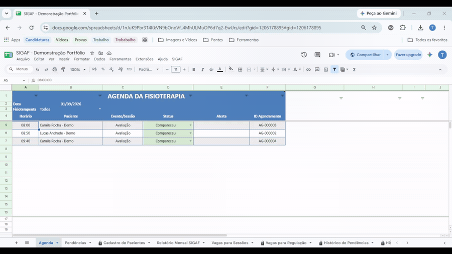
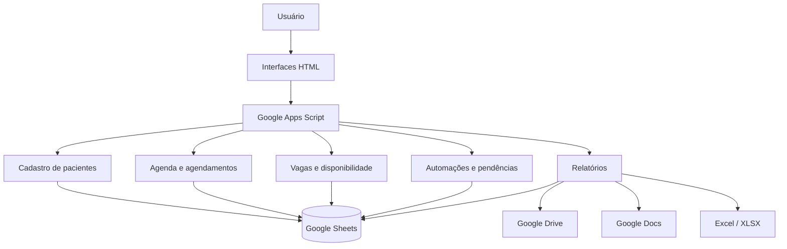

# Sistema de Gestão de Agenda Clínica

Sistema desenvolvido com **Google Apps Script e Google Sheets** para organização de pacientes, controle de agendamentos, gestão de vagas e automatização de rotinas clínicas.

O projeto surgiu da necessidade de centralizar informações que antes exigiam acompanhamento manual, criando fluxos automáticos para cadastro, agenda, sessões, pendências, bloqueios e geração de relatórios.

---
## Demonstração



---
## Sobre o projeto

A aplicação utiliza uma planilha Google Sheets como base de dados e o Google Apps Script para implementar as regras de negócio e as automações.

Também foram desenvolvidas interfaces em HTML para facilitar operações como cadastro de pacientes, renovação de tratamento, registro de desfechos, desistências e correções de agendamento.

O sistema foi estruturado de forma modular, separando as diferentes responsabilidades da aplicação.

---
## Arquitetura da solução



O Google Sheets funciona como base de dados da aplicação, enquanto o Google Apps Script concentra as regras de negócio, validações e automações. As interfaces HTML permitem a interação com os principais fluxos do sistema.
## Principais funcionalidades

- Cadastro e edição de pacientes
- Geração automática de identificadores e prontuários
- Controle de avaliações e sessões
- Consulta de disponibilidade de vagas
- Confirmação de agendamentos
- Agenda diária automatizada
- Controle de sessões realizadas e restantes
- Identificação automática de pendências
- Reposição de sessões canceladas pela clínica
- Processamento automático de bloqueios
- Tratamento automático de feriados
- Planejamento de renovação de tratamento
- Registro de desistência
- Registro de desfechos do tratamento
- Correção segura de ciclos agendados incorretamente
- Histórico de alterações e desfechos
- Geração de vagas para regulação
- Exportação de vagas para Excel
- Geração de relatórios e indicadores mensais
- Exportação de relatórios para Word
- Proteções de aviso em áreas automatizadas da planilha
- Utilitário administrativo para limpeza do ambiente de testes

---

## Tecnologias utilizadas

**Google Apps Script**  
Responsável pelas regras de negócio, automações, validações, triggers e integração com os serviços Google.

**Google Sheets**  
Utilizado como estrutura de armazenamento e gerenciamento dos dados da aplicação.

**HTML e CSS**  
Utilizados na criação das interfaces de interação com o usuário.

**JavaScript no lado cliente**  
Utilizado nos formulários HTML para validação, manipulação da interface e comunicação com o Google Apps Script por meio de `google.script.run`.

**Google Drive e Google Docs**  
Utilizados nos processos de geração e exportação de documentos e relatórios.

---

## Estrutura do projeto

```text
gestao-agenda-clinica/
│
├── README.md
│
└── src/
    ├── AgendaDiaria.gs
    ├── BloqueiosAutomaticos.gs
    ├── CadastroPacientes.gs
    ├── ConfirmarAgendamento.gs
    ├── CorrigirAgendamento.gs
    ├── DesfechoTratamento.gs
    ├── DesistenciaTratamento.gs
    ├── EditarPaciente.gs
    ├── ExportarRelatorioWord.gs
    ├── ExportarVagasRegulacao.gs
    ├── FeriadosAutomaticos.gs
    ├── LimpezaDadosTesteSIGAF.gs
    ├── Menu.gs
    ├── Pacientes.gs
    ├── PendenciasAutomaticas.gs
    ├── ProtecoesSIGAF.gs
    ├── RelatoriosSIGAF.gs
    ├── RenovacaoTratamento.gs
    ├── ReposicaoCancelamento.gs
    ├── ResultadoAvaliacao.gs
    ├── VagasRegulacao.gs
    ├── VagasSessoes.gs
    │
    └── html/
        ├── NovoPaciente.html
        ├── FormularioRenovacao.html
        ├── FormularioDesistencia.html
        ├── FormularioCorrigirAgendamento.html
        └── FormularioDesfecho.html
